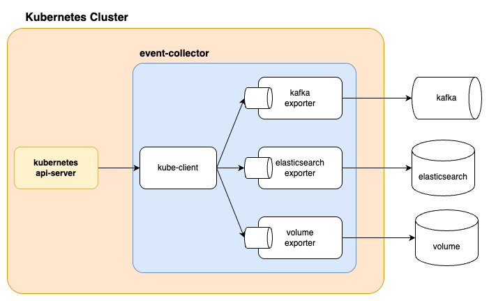
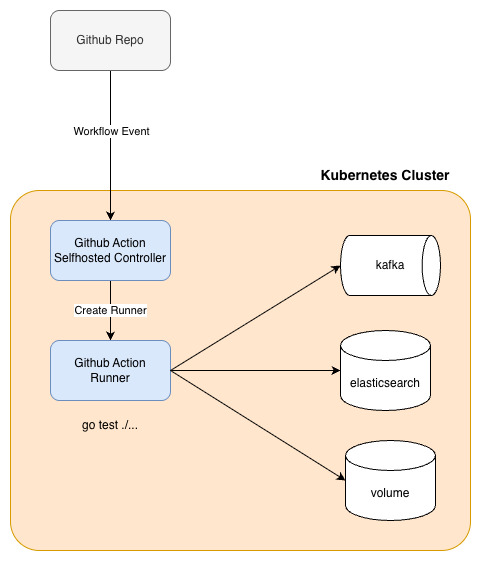

# event-collector

event-collector는 Kubernetes 클러스터 내에서 발생하는 다양한 이벤트를 실시간으로 수집하고, 이를 장기 보관과 분석이 가능한 형태로 Kafka, Elasticsearch, 혹은 Local Volume 파일 형태로 저장하는 목적으로 제작된 경량 수집기입니다.

Kubernetes는 클러스터 내부에서 발생하는 상태 변화에 대해 Event라는 특별한 리소스를 통해 중요한 정보를 제공합니다. 예를 들어, Pod가 스케줄링에 실패하거나(Node 부족, Taint 적용 등), 컨테이너가 CrashLoopBackOff 상태에 빠지거나, Kubelet이 노드를 Ready 상태로 유지하지 못하는 경우처럼 운영 과정에서 필수적으로 알아야 할 경고 또는 장애 정보를 Event 리소스를 통해 노출합니다.

그러나 Kubernetes의 Event는 기본 TTL(1시간) 이후 자동으로 삭제되는 일시적 저장 구조이기 때문에, 실제 운영 환경에서 장애를 분석하거나 트렌드를 장기적으로 관찰하기에는 적합하지 않습니다. 이벤트가 사라지기 전에 빠르게 대응하지 않으면 문제 원인을 파악하는 데 어려움이 생기며, 장애 발생의 흐름을 재현하거나 클러스터 사용 패턴을 분석하는 것도 매우 어려워집니다. 이 프로젝트는 이러한 문제 의식에서 출발하여 중요한 정보를 지속적으로 수집하고 체계적으로 보존·분석할 수 있는 별도의 수집기를 목표로 개발되었습니다.

---

## 특징

- **Informer 패턴 기반**: `client-go`의 Watch 스트리밍을 사용하여 API Server 폴링 없이 실시간으로 이벤트를 수신합니다.
- **복수 Exporter 동시 활성화**: Kafka, Elasticsearch, Volume 중 하나 이상을 동시에 사용할 수 있습니다.
- **인터페이스 기반 확장**: `Exporter` 인터페이스를 구현하면 새로운 저장소를 손쉽게 추가할 수 있습니다.
- **경량 운영**: Go 고루틴·채널 기반 비동기 처리로 CPU/메모리 사용량을 최소화합니다.
- **Graceful Shutdown**: SIGINT/SIGTERM 수신 시 버퍼에 남아 있는 데이터를 안전하게 플러시하고 종료합니다.
- **네임스페이스 필터링**: 특정 네임스페이스만 선택적으로 수집하거나, 전체 클러스터를 대상으로 동작할 수 있습니다.

---

## 아키텍처



```
Kubernetes API Server
        │  (Watch 스트리밍)
        ▼
  kube.Client (Informer)
        │  OnAdd / OnUpdate / OnDelete 콜백
        ▼
  app.Handler.handle()
        │  kube.ConvertBytes() → 공통 Event 모델 → JSON []byte
        │
        ├──▶ KafkaExporter.Write()         → sarama AsyncProducer → Kafka
        ├──▶ ElasticsearchExporter.Write() → 채널 → 버퍼 → Bulk API → Elasticsearch
        └──▶ VolumeExporter.Write()        → 채널 → 파일 기록 (크기/개수 기반 로테이션)
```

### 핵심 흐름

1. `kube.Client`가 Kubernetes API Server와 Watch 커넥션을 맺고, Event 리소스의 추가·변경·삭제를 감지합니다.
2. Informer 콜백(`OnAdd`, `OnUpdate`, `OnDelete`)이 `app.Handler`로 전달됩니다.
3. Handler는 `v1.Event`를 공통 Event 모델로 변환한 뒤 JSON으로 직렬화합니다.
4. 직렬화된 `[]byte`를 활성화된 모든 Exporter의 `Write()` 메서드로 전달합니다.
5. 각 Exporter는 내부 채널로 데이터를 수신하여, 별도 고루틴에서 비동기로 저장소에 기록합니다.

---

## Kubernetes Event 수집 방식

이 프로젝트는 Kubernetes `client-go`가 제공하는 **Informer 패턴**을 사용합니다. Informer는 API Server를 주기적으로 폴링하는 방식이 아닌, **Watch 기반 스트리밍**으로 이벤트를 수신하기 때문에 클러스터에 부담을 주지 않고 실시간에 가깝게 이벤트를 받아볼 수 있습니다.

Informer는 다음과 같은 방식으로 동작합니다.

1. **리소스 감시**: API Server에 Watch 요청을 보내고, `events.k8s.io/v1` 리소스의 변경 사항을 스트리밍으로 수신합니다.
2. **로컬 캐시**: 감시 중인 리소스의 상태를 로컬 인메모리 캐시(Store)에 유지합니다. 이를 통해 API Server에 대한 반복 조회 없이 빠르게 객체 상태를 확인할 수 있습니다.
3. **이벤트 핸들링**: `Add`, `Update`, `Delete` 이벤트가 발생할 때마다 등록된 `ResourceEventHandler`를 호출합니다. 이 프로젝트에서는 `app.Handler`가 이를 구현합니다.
4. **Resync**: 설정된 주기(기본값: 비활성화)마다 전체 객체 목록을 재동기화하여 캐시 일관성을 보장합니다. 최솟값은 10분입니다.

네임스페이스 설정에 따라 두 가지 모드로 동작합니다.

- `namespaces`가 비어 있으면: 클러스터 전체를 대상으로 하는 단일 `SharedInformerFactory`를 생성합니다.
- `namespaces`에 값이 있으면: 각 네임스페이스마다 별도의 `SharedInformerFactory`를 생성하여 격리된 Watch 커넥션을 유지합니다.

---

## Exporter 종류

### Kafka Exporter

Kafka Exporter는 수집된 이벤트 데이터를 Apache Kafka 토픽으로 비동기 전송합니다. `sarama` 라이브러리의 `AsyncProducer`를 기반으로 동작하며, 별도의 성공/실패 이벤트 루프를 통해 전송 결과를 처리합니다.

대규모 이벤트 처리나 스트리밍 파이프라인 구성에 적합합니다. 규모가 큰 클러스터(수백 개 이상의 노드, 수천 개의 Pod)에서도 안정적으로 이벤트를 전달할 수 있으며, Flink, Spark, Kafka Streams, ksqlDB 같은 분석 시스템과 연동하여 실시간 분석 환경을 구성할 수 있습니다.

**주요 설정값**:

| 옵션           | 설명                          | 기본값 |
|----------------|-------------------------------|--------|
| `brokers`      | Kafka 브로커 주소 목록 (필수) | -      |
| `topic`        | 이벤트를 전송할 토픽 (필수)   | -      |
| `timeout`      | 프로듀서 요청 타임아웃        | 0      |
| `retry`        | 전송 실패 시 재시도 횟수      | 0      |
| `retryBackoff` | 재시도 간격                   | 0      |
| `flushMsg`     | 배치 전송 메시지 수 기준      | 0      |
| `flushTime`    | 배치 전송 시간 기준           | 0      |
| `flushByte`    | 배치 전송 바이트 기준         | 0      |

### Elasticsearch Exporter

Elasticsearch Exporter는 운영 모니터링과 장애 분석을 위해 설계되었습니다. 이벤트를 내부 버퍼에 누적하다가 **플러시 조건(크기 또는 시간 초과)**이 충족되면 Bulk API로 일괄 전송하여 네트워크 오버헤드를 최소화합니다.

이벤트를 Elasticsearch에 저장하면 Kibana를 통해 문제 시점별로 이벤트를 검색하고 필터링할 수 있으며, 특정 워크로드 또는 노드에서 반복적으로 발생하는 문제를 시각화하고 패턴을 찾을 수 있습니다. 예를 들어, 특정 Deployment에서 `CrashLoopBackOff`가 지속되거나 특정 노드에서만 `ImagePullBackOff`가 반복된다면 이를 손쉽게 확인할 수 있습니다.

**주요 설정값**:

| 옵션        | 설명                               | 기본값 |
|-------------|------------------------------------|--------|
| `addresses` | Elasticsearch 주소 목록 (필수)     | -      |
| `index`     | 이벤트를 저장할 인덱스명 (필수)    | -      |
| `chanSize`  | 수신 채널 버퍼 크기                | 200    |
| `flushTime` | 주기적 플러시 간격 (초)            | 1s     |
| `flushSize` | 버퍼 크기 기반 플러시 기준 (bytes) | 1MB    |

인증 정보는 설정 파일 대신 환경 변수(`ELASTICSEARCH_USER`, `ELASTICSEARCH_PASSWORD`)로 주입합니다.

### Volume Exporter

Volume Exporter는 이벤트 데이터를 로컬 파일 시스템에 저장합니다. 파일 크기가 `maxFileSize`를 초과하면 새 파일을 생성하고, 파일 개수가 `maxFileCount`를 초과하면 오래된 파일부터 자동으로 삭제하는 **로테이션** 기능을 제공합니다.

개발 환경에서의 테스트나 Raw 데이터 보관, AWS S3 같은 오브젝트 스토리지에 업로드하기 전 임시 저장 용도로 활용할 수 있습니다. 특히 Kafka나 Elasticsearch 인프라를 구성하기 어려운 환경에서 유용합니다.

**주요 설정값**:

| 옵션           | 설명                          | 기본값 |
|----------------|-------------------------------|--------|
| `fileName`     | 생성할 파일 이름 (필수)       | -      |
| `filePath`     | 파일을 저장할 디렉터리 (필수) | -      |
| `maxFileSize`  | 파일 1개의 최대 크기 (bytes)  | 50MB   |
| `maxFileCount` | 보관할 최대 파일 개수         | 10     |

---

## 프로젝트 구조

```
event-collector/
├── cmd/
│   └── collector/
│       ├── main.go              # 진입점: 환경 변수로 logger 초기화, 설정 로드, Collector 실행
│       └── main_test.go         # TestMain: 테스트 환경 setup/teardown
├── internal/
│   ├── app/
│   │   ├── collector.go         # Collector: Exporter/kube.Client 조립, graceful shutdown
│   │   └── handler.go           # Handler: Informer 콜백 → Exporter 전달
│   ├── config/
│   │   └── config.go            # YAML 설정 파일 로드 및 필수 항목 검증
│   ├── exporter/
│   │   ├── exporter.go          # Exporter 인터페이스 (Component: Start / Exporter: Write)
│   │   ├── elasticsearch/
│   │   │   ├── exporter.go      # ElasticsearchExporter: 채널 + 버퍼 기반 Bulk 인덱싱
│   │   │   ├── exporter_test.go
│   │   │   └── option.go        # ES 옵션 (chanSize, flushTime, flushSize, 인증 정보)
│   │   ├── kafka/
│   │   │   ├── exporter.go      # KafkaExporter: sarama AsyncProducer 기반 비동기 전송
│   │   │   ├── exporter_test.go
│   │   │   └── option.go        # Kafka 옵션 (timeout, retry, flush, partitioner, compression)
│   │   └── volume/
│   │       ├── exporter.go      # VolumeExporter: 로컬 파일 기록, 크기/개수 기반 로테이션
│   │       ├── exporter_test.go
│   │       ├── option.go        # Volume 옵션 (maxFileSize, maxFileCount, chanSize)
│   │       └── util.go          # 파일명 숫자 suffix 기준 정렬 유틸리티
│   ├── kube/
│   │   ├── client.go            # Kubernetes Informer 클라이언트 (네임스페이스별 또는 전체)
│   │   ├── client_test.go
│   │   ├── event.go             # v1.Event → 공통 Event 모델 변환 + JSON 직렬화
│   │   └── option.go            # Client 옵션 (kubeconfig, resyncPeriod, namespaces)
│   ├── logger/
│   │   ├── logger.go            # CreateGlobalLogger: 환경 aware 초기화 (dev/prd)
│   │   ├── logger_test.go
│   │   ├── option.go            # logger 옵션 (level, size, age, backup, compress, encoder)
│   │   └── writer.go            # 전역 logger 래퍼 (Debug/Info/Warn/Error/Fatal/Panic)
│   ├── pprof/
│   │   ├── pprof_dev.go         # 개발용: 0.0.0.0:6060 pprof HTTP 서버 (빌드 태그: !prd)
│   │   └── pprof_prd.go         # 운영용: no-op (빌드 태그: prd)
│   └── testutil/
│       └── dummy.go             # 테스트용 더미 kube.Event 생성기
├── manifest/
│   ├── collector-deploy.yaml    # Collector ConfigMap + Deployment manifest
│   ├── collector-rbac.yaml      # ClusterRole + ClusterRoleBinding
│   └── ghar_rbac.yaml           # GitHub Actions Runner RBAC
├── .github/
│   └── workflows/
│       └── go-test.yaml         # Go 테스트 CI (vet, race detector, timeout 포함)
├── Dockerfile                   # 멀티스테이지 빌드 (golang:1.26-alpine → alpine:3.21)
├── Makefile                     # make build: Docker 이미지 빌드
├── go.mod
└── go.sum
```

---

## 설정

설정 파일 기본 경로는 `/etc/collector/config.yaml`이며, Kubernetes ConfigMap을 통해 주입합니다.

```yaml
kube:
  config: ""           # kubeconfig 파일 경로 (비어 있으면 in-cluster 자동 설정)
  resync: 0            # informer resync 주기 (0이면 비활성화, 최솟값 10m)
  namespaces: []       # 수집 대상 네임스페이스 목록 (비어 있으면 전체 클러스터)

kafka:
  enable: false
  brokers: []          # Kafka 브로커 주소 목록 (필수)
  topic: ""            # 이벤트를 전송할 토픽 (필수)
  timeout: 0
  retry: 0
  retryBackoff: 0
  flushMsg: 0
  flushTime: 0
  flushByte: 0

elasticsearch:
  enable: false
  addresses: []        # Elasticsearch 주소 목록 (필수)
  index: ""            # 이벤트를 저장할 인덱스명 (필수)
  chanSize: 0          # 수신 채널 버퍼 크기 (기본값 200)
  flushTime: 0         # 플러시 간격 (초, 기본값 1)
  flushSize: 0         # 플러시 크기 기준 (bytes, 기본값 1MB)

volume:
  enable: false
  fileName: ""         # 파일 이름 (필수)
  filePath: ""         # 저장 디렉터리 경로 (필수)
  maxFileSize: 0       # 파일 최대 크기 (bytes, 기본값 50MB)
  maxFileCount: 0      # 최대 파일 개수 (기본값 10개)
```

### 환경 변수

로거 설정 및 Elasticsearch 인증 정보는 환경 변수로 주입합니다.

| 환경 변수                | 설명                                      | 기본값        |
|--------------------------|-------------------------------------------|---------------|
| `LOG_LEVEL`              | 최소 로그 레벨 (DEBUG, INFO, WARN, ERROR) | INFO          |
| `LOG_SIZE`               | 로그 파일 최대 크기 (MB)                  | 0 (제한 없음) |
| `LOG_AGE`                | 로그 파일 보관 기간 (일)                  | 0 (제한 없음) |
| `LOG_BACK`               | 보관할 이전 로그 파일 최대 개수           | 0 (제한 없음) |
| `LOG_COMPRESS`           | 로그 파일 gzip 압축 여부 (true/false)     | false         |
| `APP_ENV`                | `dev` 설정 시 no-op logger 사용           | -             |
| `ELASTICSEARCH_USER`     | Elasticsearch 인증 사용자명               | -             |
| `ELASTICSEARCH_PASSWORD` | Elasticsearch 인증 비밀번호               | -             |

---

## 빌드 및 실행

### 로컬 빌드

```bash
# 일반 빌드 (pprof 활성화)
go build ./cmd/collector

# 운영 빌드 (pprof 비활성화, 바이너리 크기 최소화)
go build -tags prd -ldflags="-w -s" -o collector ./cmd/collector

# 실행 (설정 파일 경로 지정 필요 시 코드 수정 또는 심볼릭 링크 활용)
./collector
```

### Docker 빌드

멀티스테이지 빌드로 최종 이미지는 `alpine:3.21` 기반이며 비루트 유저(`collector`)로 실행됩니다.

```bash
# 기본 빌드
make build

# 태그 지정
make build IMAGE_TAG=v1.0.0
```

---

## Kubernetes 배포

### 실행 조건

Pod 형태로 클러스터 내부에 배포하는 경우 Kubernetes Event 리소스에 대한 `get`, `list`, `watch` 권한이 필요합니다. 최소 권한 원칙에 따라 Event 리소스 이외의 불필요한 권한은 부여하지 않습니다.

```yaml
# collector-rbac.yaml
rules:
  - apiGroups: ["events.k8s.io"]
    resources: ["events"]
    verbs: ["get", "list", "watch"]
```

### 배포 절차

```bash
# 1. 네임스페이스 생성
kubectl create namespace event-collector

# 2. RBAC 적용 (ClusterRole + ClusterRoleBinding)
kubectl apply -f manifest/collector-rbac.yaml

# 3. Collector 배포 (ConfigMap + Deployment)
kubectl apply -f manifest/collector-deploy.yaml

# 4. 배포 확인
kubectl get pods -n event-collector
kubectl logs -f deployment/collector -n event-collector
```

`collector-deploy.yaml`에는 설정 파일을 ConfigMap으로 주입하는 구조가 포함되어 있습니다.

```yaml
volumes:
  - name: config-volume
    configMap:
      name: collector-config
volumeMounts:
  - name: config-volume
    mountPath: /etc/collector   # 기본 설정 파일 경로: /etc/collector/config.yaml
```

---

## 개발 환경 구축

개발 및 테스트 환경에서는 Elasticsearch와 Kafka를 Helm을 통해 설치합니다.

### Elasticsearch 설치

```bash
NAMESPACE=event-collector

# Elasticsearch 설치 (3노드 구성)
helm upgrade --install elasticsearch bootstrap/helm/elasticsearch \
    --namespace $NAMESPACE --create-namespace \
    -f bootstrap/helm/elasticsearch.yaml

# 배포 확인
kubectl get pods -n $NAMESPACE

# ILM 정책, 인덱스 템플릿, 초기 인덱스 생성
./bootstrap/helm/elasticsearch_ilm.sh
./bootstrap/helm/elasticsearch_template.sh
./bootstrap/helm/elasticsearch_index.sh
```

### Kafka 클러스터 설치 (Strimzi)

```bash
NAMESPACE=event-collector

# Strimzi Kafka Operator 설치
helm upgrade --install strimzi bootstrap/helm/strimzi-kafka-operator \
    --namespace $NAMESPACE --create-namespace \
    -f bootstrap/helm/strimzi.yaml

# Kafka 클러스터 및 토픽 생성
kubectl apply -f bootstrap/helm/kafka_cluster.yaml -n $NAMESPACE
kubectl apply -f bootstrap/helm/kafka_topic.yaml -n $NAMESPACE

# 배포 확인
kubectl get pods -n $NAMESPACE
```

---

## 테스트

단순한 Mock 테스트 대신 실제 Kubernetes 클러스터에서 Kafka·Elasticsearch와 연동하여 동작하는 **통합 테스트** 방식을 채택했습니다. GitHub Actions Self-Hosted Runner를 Kubernetes 클러스터 내부에 직접 배포하여 운영 환경과 동일한 조건에서 검증합니다.



### GitHub Actions 워크플로우

`develop` 브랜치 push 및 `main` 브랜치 PR 시 자동으로 실행됩니다.

```yaml
- go mod verify          # 의존성 무결성 검증
- go vet ./...           # 정적 분석
- go test -v -race -timeout 300s ./...   # race detector 포함 전체 테스트
```

외부 서비스(Kafka, Elasticsearch) 주소는 GitHub Actions Variables/Secrets로 관리하며, Runner는 클러스터 내부에서 실제 서비스와 직접 통신합니다.

### Self-Hosted Runner 설정

```bash
# RBAC 설정
NAMESPACE=gh-runner
kubectl create namespace ${NAMESPACE}
kubectl apply -f manifest/ghar_rbac.yaml

# gha-runner-controller 설치
helm upgrade --install gh-arc \
    oci://ghcr.io/actions/actions-runner-controller-charts/gha-runner-scale-set-controller \
    --namespace "${NAMESPACE}" --create-namespace

# Self-Hosted Runner 배포
helm upgrade --install gh-runner \
    oci://ghcr.io/actions/actions-runner-controller-charts/gha-runner-scale-set \
    --namespace ${NAMESPACE} --create-namespace \
    -f bootstrap/helm/gh-runner.yaml \
    --set githubConfigSecret.github_token=${GITHUB_TOKEN} \
    --set githubConfigUrl=${GITHUB_REPO}
```

### 로컬 테스트 실행

```bash
# race condition 검사 포함 전체 테스트
go test -race ./...

# Volume Exporter 단위 테스트 (외부 서비스 불필요)
go test -v ./internal/exporter/volume/...

# Elasticsearch/Kafka 통합 테스트 (서비스 환경 변수 필요)
ELASTICSEARCH_ADDR=http://localhost:9200 \
ELASTICSEARCH_INDEX=event \
go test -v ./internal/exporter/elasticsearch/...
```

---

## 주요 의존성

| 패키지                                   | 버전    | 용도                              |
|------------------------------------------|---------|-----------------------------------|
| `k8s.io/client-go`                       | v0.32.x | Kubernetes Informer, Clientset    |
| `k8s.io/api`                             | v0.32.x | Kubernetes Event v1 타입          |
| `github.com/IBM/sarama`                  | v1.x    | Kafka 비동기 프로듀서             |
| `github.com/elastic/go-elasticsearch/v8` | v8.x    | Elasticsearch Bulk API 클라이언트 |
| `go.uber.org/zap`                        | v1.x    | 고성능 구조화 로깅                |
| `gopkg.in/natefinch/lumberjack.v2`       | v2.x    | 운영용 로그 파일 로테이션         |
| `gopkg.in/yaml.v3`                       | v3.x    | 설정 파일 YAML 파싱               |
